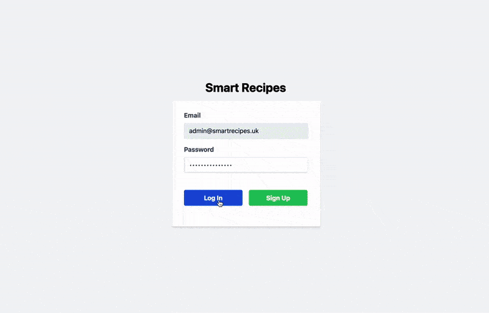

# Smart Recipes

## Overview

An app to create and manage your recipes, using AI.

## Demo

## Functionality

After signing up or logging in, you can create, view, update and delete your unique recipes.

When a recipe is being created, enjoy a snake game while the AI does its magic...

### Creating a recipe

The user's prompts such as custom instructions, servings and selection from a list of requirements are taken into account before creating a recipe.

### Managing recipes

The saved recipes page shows most recent items at the top, and the user can search, update and delete recipes there.

## Instructions

No installation needed. Use smart recipes here:

https://smart-recipes.netlify.app/login

RECOMMENDED: use this password when signing up the first time `SmartRecipes1!`

## Tech Stack

**Client:**

- React + Vite
- OpenAI API
- Redux for global state management
- TailwindCSS

**Server:**

- MongoDB
- Node + Express
- JWT with Bcrypt for secure authentication

**Testing (in progress):**

- Thunder client for testing requests to backend API routes
- CodiumAI for debugging
- I am working on E2E testing for the main user-flow with Cypress
